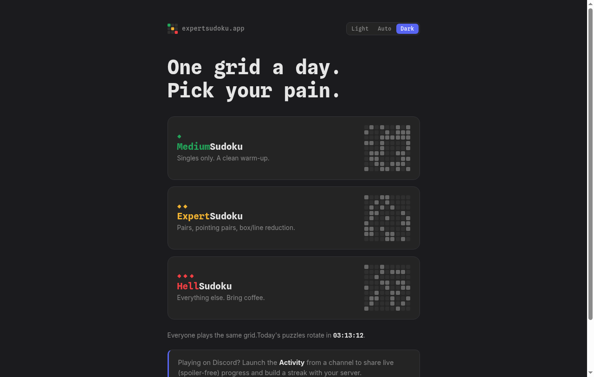
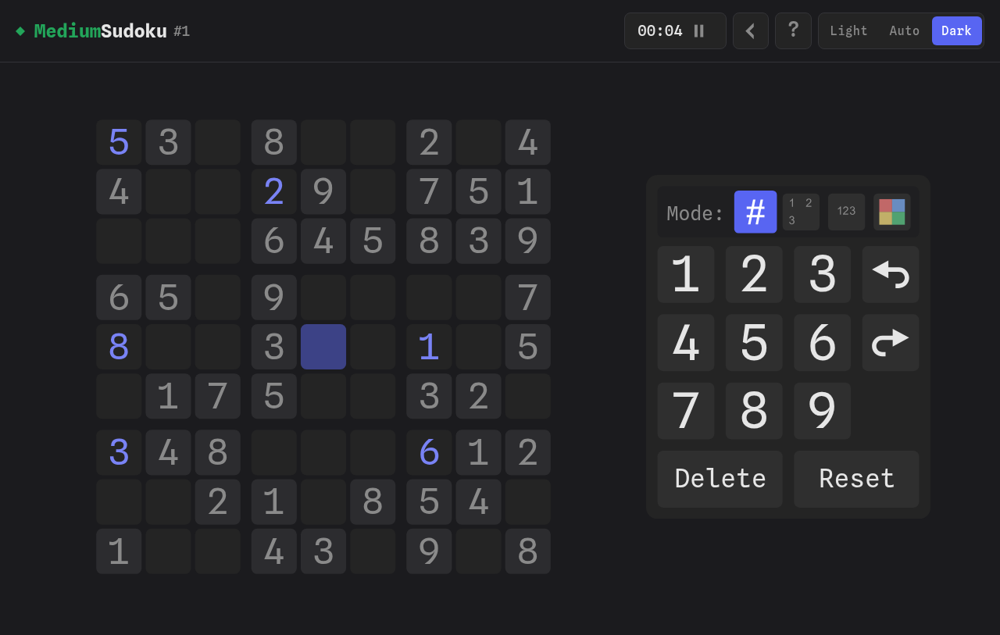
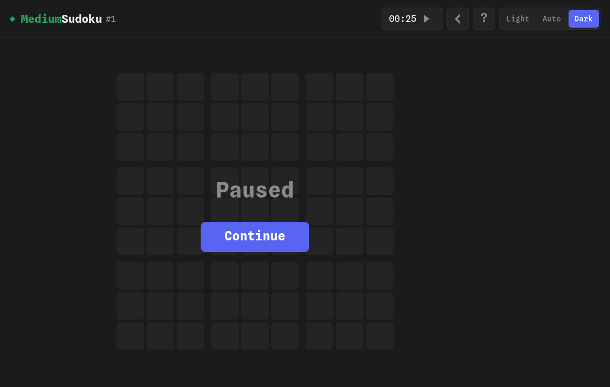
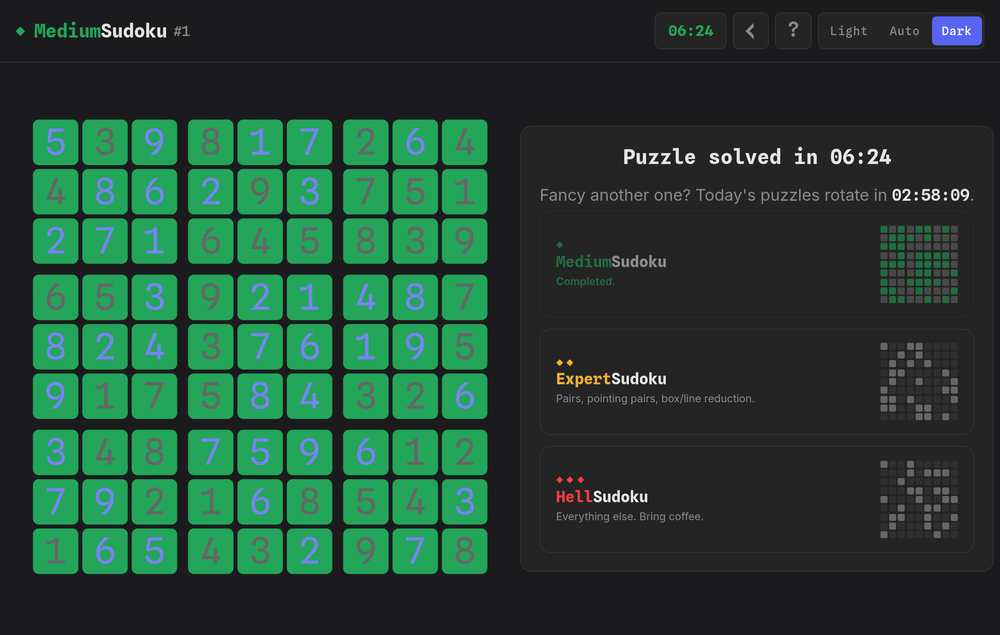

<div align="center">


# ExpertSudoku

**One grid a day. Pick your pain.**

A daily sudoku in three difficulties — **MediumSudoku**, **ExpertSudoku** and **HellSudoku** —
playable as a Discord Activity with live, spoiler-free progress boards and server streaks,
or in any browser at [expertsudoku.app](https://expertsudoku.app).

</div>

<p align="center">
  
</p>

Everyone in the world plays the same three grids; new puzzles arrive at 00:00 UTC.
MediumSudoku needs singles only — a clean warm-up. ExpertSudoku adds pairs, pointing
pairs and box/line reduction. HellSudoku is everything else — bring coffee.

**Play together, spoil nothing.** Launch the Activity from a Discord channel and a live
board appears in chat: it shows which cells each player has filled — never the digits —
alongside avatars and running times. Up to four boards race side by side.

**Keep the streak alive.** Every day at least one member solves a puzzle, your server's
streak grows; miss a day and it resets. Each night the bot posts the day's results with
a leaderboard of the fastest solvers.

**Built for the way you actually play.** Progress saves automatically — leave mid-puzzle
and pick it up later on the same board. Pausing hides the grid (no cheating at the
office). Solved a puzzle? Revisit your solution any time, or jump straight into the next
difficulty. No accounts, no ads, no data sold — ever.

<p align="center">
  
  
</p>

<p align="center">
  
</p>

---

## Technical details

ExpertSudoku is a fork of [grantm/sudoku-web-app](https://github.com/grantm/sudoku-web-app)
(the app behind [SudokuExchange.com](https://sudokuexchange.com)), extended with a
Discord Embedded App SDK integration and a Cloudflare Workers backend (Hono + D1 via
Drizzle). One codebase serves both the standalone website and the Discord Activity;
the client detects the Discord iframe via the `frame_id` query param.

> **Note:** the Cloudflare Worker was renamed from `daily-sudoku` to `expertsudoku` (see `wrangler.json`). This creates a *new* Worker on deploy — the old `daily-sudoku` Worker is not automatically replaced and should be deleted manually from the Cloudflare dashboard once the new one is confirmed working. The D1 database is `expertsudoku-prod`; only the `DB` binding matters to the code.

### Development setup

```sh
npm install
npm run dev          # http://localhost:3000 - plain website works immediately
npm run dev:discord  # build + serve production bundle on :3000 - REQUIRED for testing inside Discord
```

> **Testing inside Discord?** Use `npm run dev:discord`. Discord's activity proxy applies a CSP without `style-src 'unsafe-inline'`, and Vite's dev server injects all CSS as inline `<style>` tags — so `npm run dev` renders completely unstyled inside the Discord iframe (giant SVGs, default buttons; the CSP violations only show in the iframe's console context). The production bundle uses an external CSS file, which the CSP allows. No HMR — re-run after changes.

The website (`/`, `/play`, `/imprint`, `/privacy`, `/terms`) works against a plain `localhost:3000` with no further setup. The Discord Activity path additionally needs:

- A Discord application (https://discord.com/developers/applications) with an Activity configured, its Client ID in `.env` as `VITE_CLIENT_ID`, and its Client Secret in `.env` as `CLIENT_SECRET`.
- A public URL for Discord to load the Activity from — a named [cloudflared](https://developers.cloudflare.com/cloudflare-one/connections/connect-networks/) tunnel forwarding to `localhost:3000` (see `config.yml`, gitignored), with that hostname allowlisted in `vite.config.ts`'s `server.allowedHosts`. In the Discord Developer Portal, set the Activity's "Root Mapping" URL to the tunnel hostname.
- `.dev.vars` (gitignored) with `SESSION_SECRET` (any random string), `DISCORD_BOT_TOKEN` (a bot token with the `Send Messages` permission, invited to whatever test server/channel you use), and `DISCORD_PUBLIC_KEY` (the app's "Public Key" from the portal's General Information page, used to verify button interactions) for the session auth + live-message features. `npm run cf-typegen` after changing bindings in `wrangler.json`.

### Database (D1 via Drizzle)

```sh
npm run db:generate           # after changing db/schema.ts, writes drizzle/*.sql
npm run db:migrate:local      # apply migrations to the local dev D1
npm run seed:generate -- --start 2026-01-01 --days 7   # writes seed.sql
npm run seed:local            # loads seed.sql into the local dev D1
```

`scripts/mint-dev-token.mjs` signs a session JWT from `.dev.vars`'s `SESSION_SECRET` so the session-authed `/api/progress` routes can be curled directly without a full Discord OAuth handshake:

```sh
node scripts/mint-dev-token.mjs --sub <discord-user-id> --chan <channel-id> [--guild <guild-id>]
```

### Production deploy (manual steps)

1. `wrangler secret put CLIENT_SECRET`, `wrangler secret put SESSION_SECRET`, `wrangler secret put DISCORD_BOT_TOKEN` (only `VITE_CLIENT_ID` and `DISCORD_PUBLIC_KEY` — the app's public verification key, not a secret — live in `wrangler.json`'s plaintext `vars`).
2. `npm run db:migrate:remote`, then `npm run seed:generate -- --days 30 && npm run seed:remote` (re-run periodically to keep puzzles ahead of the current day).
3. `npm run deploy`.
4. In the Discord Developer Portal, set the Activity's URL mapping root to `expertsudoku.app` (no extra proxy mappings needed — client fetches are same-origin `/api/*`; all Discord/CDN traffic happens worker-side), and set the "Interactions Endpoint URL" to `https://expertsudoku.app/api/interactions` (the portal probes it with signed + deliberately bad-signature requests; the endpoint must be deployed with `DISCORD_PUBLIC_KEY` set before saving). Ensure the bot has been invited with the `Send Messages` permission to any server that will use live progress messages/streak announcements.
5. `wrangler.json`'s `routes` points at the `expertsudoku.app` custom domain — the zone must already exist in the Cloudflare account.
6. Delete the old `daily-sudoku` Worker from the Cloudflare dashboard once `expertsudoku` is confirmed working.

### Original sudoku-web-app features

Features include:

* Enter a puzzle into a blank grid (e.g: transcribe a printed puzzle)
* Check that the puzzle has a unique solution (in case you made a typo)
* Share a puzzle as a link [like this](https://sudokuexchange.com/play/?s=000001230123008040804007650765000000000000000000000123012300804080400765076500000)
* Two types of pencilmarks (for Snyder notation and doubles/triples or simple candidate lists)
* Cell colouring
* An optional dark mode theme
* Keyboard shortcuts for desktop browsers (including Ctrl-Z/Y Undo/Redo)
* Touchscreen support for mobile or tablet browsers
* Help option on the menu to access user guide
* Multi-cell selections for entering pencil marks
* Flexible display: scales up to huge screens or down to small screens, adapts
  automatically to portrait vs landscape orientation, and supports full screen mode
  to remove distractions
* Configurable options so you can turn on the features you find helpful and turn
  off the features you find annoying
* Free to use and no ads
* Full source code available

## Copyright and License

This software is copyright (c) 2019 Grant McLean <grant@mclean.net.nz> and is
released as free software under the terms of the GNU Affero General Public
License (AGPL) version 3 or later.  You may use, copy, modify and share the
software under the terms of that license.
